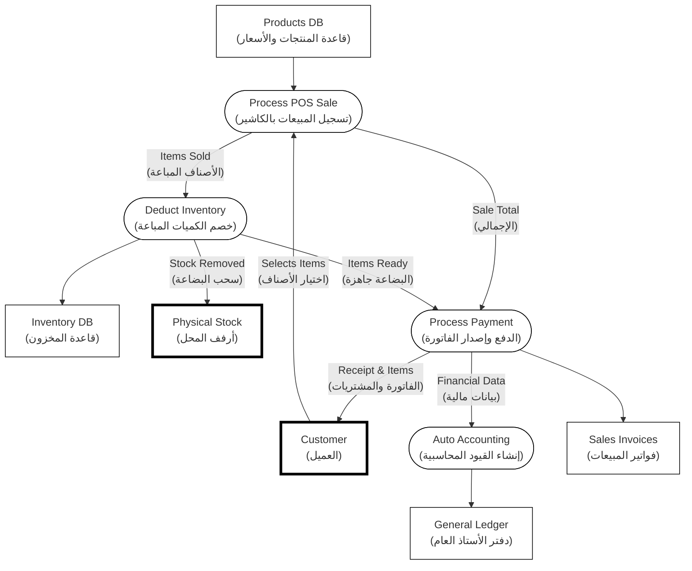

# Data Flow Diagram (DFD) - Attar AIS

هذا المخطط مصمم خصيصاً ليتناسب مع **المنطق الحقيقي لمحل العطارة (نظام نقطة البيع POS)** الخاص بك، مع الحفاظ على الشكل الهندسي المنظم الذي تفضله.

```mermaid
flowchart TD
    %% Styling
    classDef entity fill:#fff,stroke:#000,stroke-width:4px,shape:rect;
    classDef process fill:#fff,stroke:#000,stroke-width:1px,rx:15,ry:15;
    classDef store fill:#fff,stroke:#000,stroke-width:1px,shape:rect;

    %% قواعدد البيانات العلوية
    PROD["Products DB<br>(قاعدة المنتجات والأسعار)"]:::store
    INV_DB["Inventory DB<br>(قاعدة المخزون)"]:::store

    %% الكيانات الخارجية
    CUST["Customer<br>(العميل)"]:::entity
    STOCK["Physical Stock<br>(أرفف المحل)"]:::entity

    %% العمليات الوسطى
    POS(["Process POS Sale<br>(تسجيل المبيعات بالكاشير)"]):::process
    DEDUCT(["Deduct Inventory<br>(خصم الكميات المباعة)"]):::process

    %% العمليات السفلية
    PAY(["Process Payment<br>(الدفع وإصدار الفاتورة)"]):::process
    ACC(["Auto Accounting<br>(إنشاء القيود المحاسبية)"]):::process

    %% قواعد البيانات السفلية
    SALES["Sales Invoices<br>(فواتير المبيعات)"]:::store
    GL["General Ledger<br>(دفتر الأستاذ العام)"]:::store

    %% -----------------------
    %% مسارات البيانات (Data Flows)
    %% -----------------------

    %% الكاشير يقرأ بيانات وأسعار المنتجات
    PROD --> POS
    
    %% العميل يختار المنتجات ويذهب للكاشير
    CUST -- "Selects Items<br>(اختيار الأصناف)" --> POS
    
    %% الكاشير يرسل أمر بخصم البضاعة المباعة
    POS -- "Items Sold<br>(الأصناف المباعة)" --> DEDUCT
    
    %% تحديث قاعدة بيانات المخزون
    DEDUCT --> INV_DB
    
    %% سحب البضاعة فعلياً من الأرفف
    DEDUCT -- "Stock Removed<br>(سحب البضاعة)" --> STOCK
    
    %% إرسال إجمالي الفاتورة لعملية الدفع
    POS -- "Sale Total<br>(الإجمالي)" --> PAY
    
    %% البضاعة جاهزة للتسليم للعميل
    DEDUCT -- "Items Ready<br>(البضاعة جاهزة)" --> PAY
    
    %% تسليم الفاتورة والبضاعة للعميل
    PAY -- "Receipt & Items<br>(الفاتورة والمشتريات)" --> CUST
    
    %% حفظ الفاتورة في قاعدة البيانات
    PAY --> SALES
    
    %% إرسال البيانات المالية لبرنامج المحاسبة
    PAY -- "Financial Data<br>(بيانات مالية)" --> ACC
    
    %% ترحيل القيود لدفتر الأستاذ
    ACC --> GL

```
