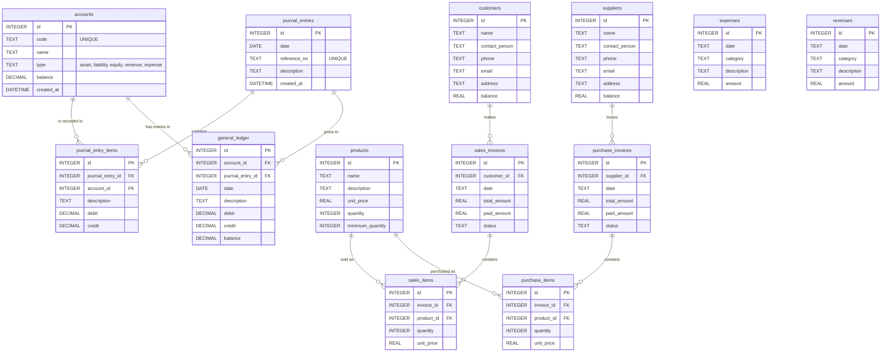

# مخطط الكيانات والعلاقات (ERD) لمشروع AttarAIS

بناءً على ملف إعداد قاعدة البيانات `db_config.py`، إليك مخطط الكيانات والعلاقات (ERD) الخاص بالمشروع والذي يوضح الجداول والحقول والعلاقات بينها.

### تفاصيل العلاقات:

*   **القيود اليومية (Journal Entries):**
    *   كل قيد يومية (`journal_entries`) يمكن أن يحتوي على عدة عناصر (`journal_entry_items`).
    *   يتم ربط كل عنصر قيد بحساب معين من جدول الحسابات (`accounts`).
*   **دفتر الأستاذ العام (General Ledger):**
    *   يتم ترحيل الحركات من القيود اليومية إلى دفتر الأستاذ العام وتُربط برقم القيد (`journal_entry_id`) ورقم الحساب (`account_id`).
*   **المبيعات (Sales):**
    *   كل عميل (`customers`) يمكن أن يكون لديه عدة فواتير مبيعات (`sales_invoices`).
    *   كل فاتورة مبيعات تحتوي على عدة عناصر/أصناف (`sales_items`).
    *   عناصر الفاتورة مرتبطة بجدول المنتجات (`products`).
*   **المشتريات (Purchases):**
    *   كل مورد (`suppliers`) يمكن أن تصدر منه عدة فواتير مشتريات (`purchase_invoices`).
    *   كل فاتورة مشتريات تحتوي على عدة عناصر (`purchase_items`).
    *   عناصر فاتورة الشراء مرتبطة أيضاً بجدول المنتجات (`products`).
*   **المصروفات والإيرادات (Expenses & Revenues):**
    *   جداول مستقلة (مبدئياً في هذا الإعداد) لتسجيل الحركات المباشرة.
